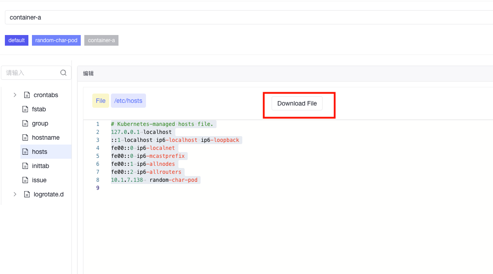
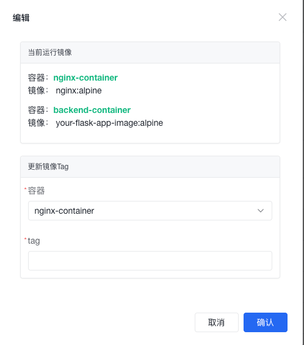
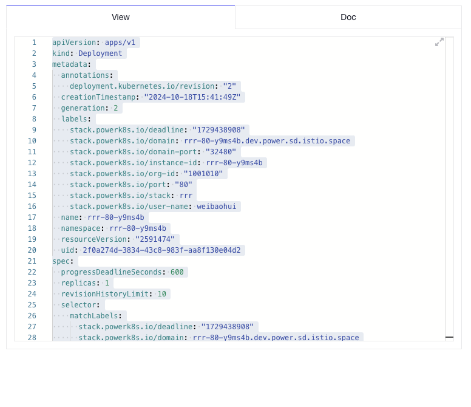
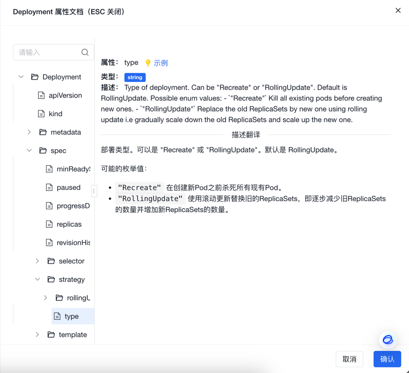
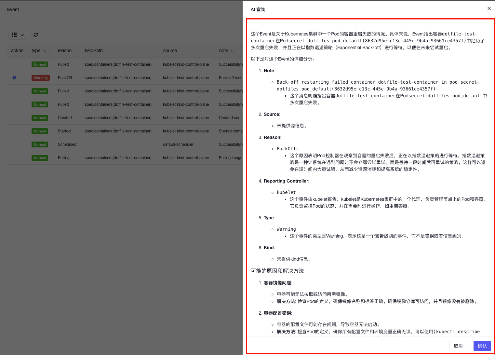
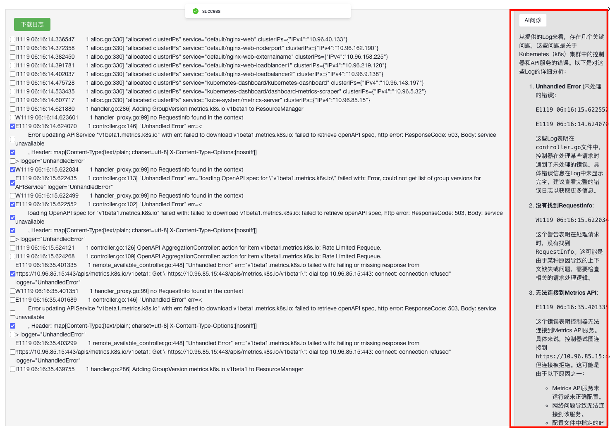

## **k8m**

[English](README_en.md) | [中文](README.md)

[](https://github.com/weibaohui/k8m/blob/master/LICENSE)

**k8m** 是一款AI驱动的 Mini Kubernetes AI Dashboard 轻量级控制台工具，专为简化集群管理设计。它基于 AMIS 构建，并通过  [
`kom`](https://github.com/weibaohui/kom)  作为 Kubernetes API 客户端，**k8m** 内置了 Qwen2.5-Coder-7B
模型交互能力，同时支持接入您自己的私有化大模型。

### 主要特点

- **迷你化设计**：所有功能整合在一个单一的可执行文件中，部署便捷，使用简单。
- **简便易用**：友好的用户界面和直观的操作流程，让 Kubernetes 管理更加轻松。
- **高效性能**：后端采用 Golang 构建，前端基于百度 AMIS，保证资源利用率高、响应速度快。
- **AI驱动融合**：基于ChatGPT实现页面指南、资源使用场景、YAML属性自动翻译、Describe信息解读、日志AI问诊、运行命令推荐等，为管理k8s提供智能化支持。
- **多集群管理**：自动识别集群内部使用InCluster模式，配置kubeconfig路径后自动扫描同级目录下的配置文件，同时注册管理多个集群。
- **Pod 文件管理**：支持 Pod 内文件的浏览、编辑、上传、下载、删除，简化日常操作。
- **Pod 运行管理**：支持实时查看 Pod 日志，下载日志，并在 Pod 内直接执行 Shell 命令。
- **CRD 管理**：可自动发现并管理 CRD 资源，提高工作效率。
- **跨平台支持**：兼容 Linux、macOS 和 Windows，并支持 x86、ARM 等多种架构，确保多平台无缝运行。

**k8m** 的设计理念是“AI驱动，轻便高效，化繁为简”，它帮助开发者和运维人员快速上手，轻松管理 Kubernetes 集群。

## **运行**

1. **下载**：从 [GitHub](https://github.com/weibaohui/k8m) 下载最新版本。
2. **运行**：使用 `./k8m` 命令启动,访问[http://127.0.0.1:3618](http://127.0.0.1:3618)。
3. **参数**：

```shell
  ./k8m -h
      --add_dir_header                   If true, adds the file directory to the header of the log messages
      --alsologtostderr                  log to standard error as well as files (no effect when -logtostderr=true)
  -k, --chatgpt-key string               API Key for ChatGPT (default "sk-XXXX")
  -u, --chatgpt-url string               API URL for ChatGPT (default "https://api.siliconflow.cn/v1")
  -d, --debug                            Debug mode,same as GIN_MODE
  -c, --kubeconfig string                Absolute path to the kubeConfig file (default "/Users/xxx/.kube/config")
      --log_backtrace_at traceLocation   when logging hits line file:N, emit a stack trace (default :0)
      --log_dir string                   If non-empty, write log files in this directory (no effect when -logtostderr=true)
      --log_file string                  If non-empty, use this log file (no effect when -logtostderr=true)
      --log_file_max_size uint           Defines the maximum size a log file can grow to (no effect when -logtostderr=true). Unit is megabytes. If the value is 0, the maximum file size is unlimited. (default 1800)
      --logtostderr                      log to standard error instead of files (default true)
      --one_output                       If true, only write logs to their native severity level (vs also writing to each lower severity level; no effect when -logtostderr=true)
  -p, --port int                         Port for the server to listen on (default 3618)
      --skip_headers                     If true, avoid header prefixes in the log messages
      --skip_log_headers                 If true, avoid headers when opening log files (no effect when -logtostderr=true)
      --stderrthreshold severity         logs at or above this threshold go to stderr when writing to files and stderr (no effect when -logtostderr=true or -alsologtostderr=true) (default 2)
  -v, --v Level                          number for the log level verbosity (default 0)
      --vmodule moduleSpec               comma-separated list of pattern=N settings for file-filtered logging
```

## **ChatGPT 配置指南**

### 内置GPT

从v0.0.8版本开始，将内置GPT，无需配置。
如果您需要使用自己的GPT，请参考以下步骤。

### **环境变量配置**

需要设置环境变量，以启用ChatGPT。

```bash
export OPENAI_API_KEY="sk-XXXXX"
export OPENAI_API_URL="https://api.siliconflow.cn/v1"
export OPENAI_MODEL="Qwen/Qwen2.5-Coder-7B-Instruct"
```

### **ChatGPT 状态调试**

如果设置参数后，依然没有效果，请尝试使用`./k8m -v 6`获取更多的调试信息。
会输出以下信息，通过查看日志，确认是否启用ChatGPT。

```go
ChatGPT 开启状态:true
ChatGPT 启用 key:sk-hl**********************************************, url:https: // api.siliconflow.cn/v1
ChatGPT 使用环境变量中设置的模型:Qwen/Qwen2.5-Coder-7B-Instruc
```

### **ChatGPT 账户**

本项目集成了[github.com/sashabaranov/go-openai](https://github.com/sashabaranov/go-openai)SDK。
国内访问推荐使用[硅基流动](https://cloud.siliconflow.cn/)的服务。
登录后，在[https://cloud.siliconflow.cn/account/ak](https://cloud.siliconflow.cn/account/ak)创建API_KEY

## 容器化k8s集群方式运行

使用[KinD](https://kind.sigs.k8s.io/docs/user/quick-start/)、[MiniKube](https://minikube.sigs.k8s.io/docs/start/)
安装一个小型k8s集群

## KinD方式

* 创建 KinD Kubernetes 集群

```
brew install kind
```

* 创建新的 Kubernetes 集群：

```
kind create cluster --name k8sgpt-demo
```

# 将k8m部署到集群中体验

## 安装脚本

```docker
kubectl apply -f https://raw.githubusercontent.com/weibaohui/k8m/refs/heads/main/deploy/k8m.yaml
```

* 访问：
  默认使用了nodePort开放，请访问31999端口。或自行配置Ingress
  http://NodePortIP:31999

### **跨平台编译支持**

**build-all** 目标支持以下操作系统和架构组合的交叉编译：

- **Linux**:
    - `amd64`
    - `arm64`
    - `ppc64le`
    - `s390x`
    - `mips64le`
    - `riscv64`
- **Darwin（macOS）**:
    - `amd64`
    - `arm64`
- **Windows**:
    - `amd64`
    - `arm64`

### **使用示例**

#### **1. 为当前平台构建**

构建适用于当前操作系统和架构的 `k8m` 可执行文件：

```bash
make build
```

#### **2. 为所有支持的平台构建**

交叉编译 `k8m` 为所有指定的平台和架构：

```bash
make build-all
```

#### **3. 运行可执行文件**

在 Unix 系统上构建并运行 `k8m`：

```bash
make run
```

#### **4. 清理构建产物**

删除所有编译生成的可执行文件和 `bin/` 目录：

```bash
make clean
```

#### **5. 查看帮助信息**

显示所有可用的 Makefile 目标及其描述：

```bash
make help
```

### **附加说明**

- **版本控制**：你可以在构建时通过传递 `VERSION` 变量来指定自定义版本：
  ```bash
  make build VERSION=v2.0.0
  ```
- **可执行文件扩展名**：对于 Windows 构建，Makefile 会自动为可执行文件添加 `.exe` 扩展名。
- **依赖性**：确保 Git 已安装并且项目已初始化为 Git 仓库，以便正确获取 `GIT_COMMIT` 哈希值。

### **故障排除**

- **缺少依赖**：如果遇到与缺少命令相关的错误（如 `make`、`go` 等），请确保所有先决条件已安装并正确配置在系统的 `PATH` 中。
- **权限问题**：如果在运行 `make run` 时收到权限被拒绝的错误，请确保 `bin/` 目录和编译后的二进制文件具有必要的执行权限：
  ```bash
  chmod +x bin/k8m
  ```
- **文件浏览权限问题**：依赖容器内的ls命令，请在容器内安装shell、tar、cat等命令 。
- **无法启动**：启动时卡住，请使用 k8m -v 6
  命令启动，会输出更多日志，一般是由于部分版本的k8s集群的openAPI文档格式问题导致，请将日志贴到issue，或微信发我，我将优先处理 。

## **运行界面**

### 负载


### Pod内文件编辑


### 上传文件到Pod内


### Pod内文件下载



### Tag更新



### 查看日志


### YAML 属性自动翻译

k8m 提供集成的 YAML 浏览、编辑和文档查看功能，支持自动翻译 YAML
属性。无论是查找字段含义还是确认配置细节，您都无需再费时费力地搜索，极大提高了工作效率。  



### Event 信息 AI 问诊

在 Event 页面，k8m 内置了 AI
问诊功能，可智能分析异常事件，并提供详细的解释。点击事件前的“AI大脑”按钮，稍等片刻即可查看诊断结果，快速定位问题原因。  


### 错误日志 AI 问诊

日志分析是定位问题的重要环节，但面对大量报错信息，如何高效排查？k8m 支持 AI 日志诊断，帮助快速识别关键错误并生成解决建议。只需选中相关日志，点击
AI 问诊按钮，即可获得诊断报告。  


### 运行命令自动生成

日常运维中，Pod 内命令操作不可避免。借助 AI，您只需输入需求描述，k8m 即可自动生成合适的命令供参考，减少查找时间，提高效率。  


**v0.0.15更新**

1. 所有页面增加资源使用指南。启用AI信息聚合。包括资源说明、使用场景（举例说明）、最佳实践、典型示例（配合前面的场景举例，编写带有中文注释的yaml示例）、关键字段及其含义、常见问题、官方文档链接、引用文档链接等信息，帮助用户理解k8s
   
2. 所有资源页面增加搜索功能。部分页面增高频过滤字段搜索。
   
3. 改进LimitRange信息展示模式
   
4. 改进状态显示样式
   
5. 统一操作菜单
   
6. Ingress页面增加域名转发规则信息
   
7. 改进标签显示样式，鼠标悬停展示
   
8. 优化资源状态样式更小更紧致
   
9. 丰富Service展示信息
   
10. 突出显示未就绪endpoints
    
11. endpoints鼠标悬停展开未就绪IP列表
    
12. endpointslice 突出显示未ready的IP及其对应的POD，
    
13. 角色增加延展信息
    
14. 角色与主体对应关系
    
15. 界面全量中文化，k8s资源翻译为中文，方便广大用户使用。
    
    

**v0.0.19更新**

1. 多集群管理功能
   按需选择多集群，可随时切换集群
   
2. 节点资源用量功能
   直观显示已分配资源情况，包括cpu、内存、pod数量、IP数量。
   
3. Pod 资源用量
   
4. Pod CPU内存设置
   按范围方式显示CPU设置，内存设置，简洁明了
   
5. AI页面功能升级为打字机效果
   响应速度大大提升，实时输出AI返回内容，体验升级
   

**v0.0.21更新**

1. 新增问AI功能：
   有什么问题，都可以直接询问AI，让AI解答你的疑惑
   
   
2. 文档界面优化：
   优化AI翻译效果，降低等待时间
   
3. 文档字段级AI示例：
   针对具体的字段，给出解释，给出使用Demo样例。
   
4. 增加容忍度详情：
   
5. 增加Pod关联资源
   一个页面，展示相关的svc、endpoint、pvc、env、cm、secret，甚至集成了pod内的env列表，方便查看
   
   
   
   
   
   
   
6. yaml创建增加导入功能：
   增加导入功能，可以直接执行，也可导入到编辑器。导入编辑器后可以二次编辑后，再执行。
   
   

### HELP & SUPPORT

如果你有任何进一步的问题或需要额外的帮助，请随时与我联系！

### 特别鸣谢

[zhaomingcheng01](https://github.com/zhaomingcheng01)：提出了诸多非常高质量的建议，为k8m的易用好用做出了卓越贡献~

## 联系我

微信（大罗马的太阳） 搜索ID：daluomadetaiyang,备注k8m。